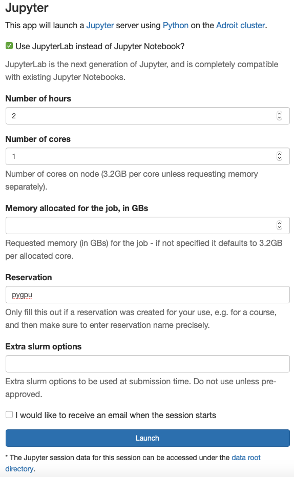

# PyGPU: High performance Python for GPUs
## Henry Schreiner

This minicourse covers ways to speed up your code using GPUs.
Since many of us do not have a reasonable (NVidia) GPU on our
laptops, the course is designed to be run on our local teaching
cluster. You will need to be on the Princeton network, and will
need to be able to access Adroit (registration beforehand required).

## Princeton setup (Adroit)

#### Git clone

Log into our OnDemand site, <https://myadroit.princeton.edu>. You will want to
select "Clusters -> Shell" on the header bar.


Now, you'll want to type:

```bash
git clone https://github.com/henryiii/pygpu-minicourse
```

This will get the course materials. Press <kbd>CTRL</kbd>+<kbd>D</kbd> to quit.

#### Start up a CPU instance

We will be working with a small number of shared GPUs, so you'll want to work in a CPU only instance, and only submit a notebook to the GPU 1-at-a-time (so you don't block them for others).

Back on the header bar on the original page, click "Interactive Apps" or "My Interactive sessions", then select "Jupyter". You should see a page that looks like this:

> 

Make sure you have **checked the JupyterLab** checkbox, that you have enough time (at least 2 hours), and that you have entered our reservation (`pygpu`). Leave the extra slurm options blank. 

After you click launch, you should soon see a button that looks like this:


Click it to enter JupyterLab!

### Local setup

If you have a GPU, you can install the environment provided in `interactive/environment.yml` with Conda. You'll probably have to choose a kernel when you launch it (and you may need the `conda_nb_kernel` package).

## Running GPU kernels

Load the `ExampleRunner.ipynb` notebook. You can enter the name of a GPU notebook (without the extension) at the top of the provided cell, and run that to submit the notebook as a job.